拿到题目先查壳和文件类型

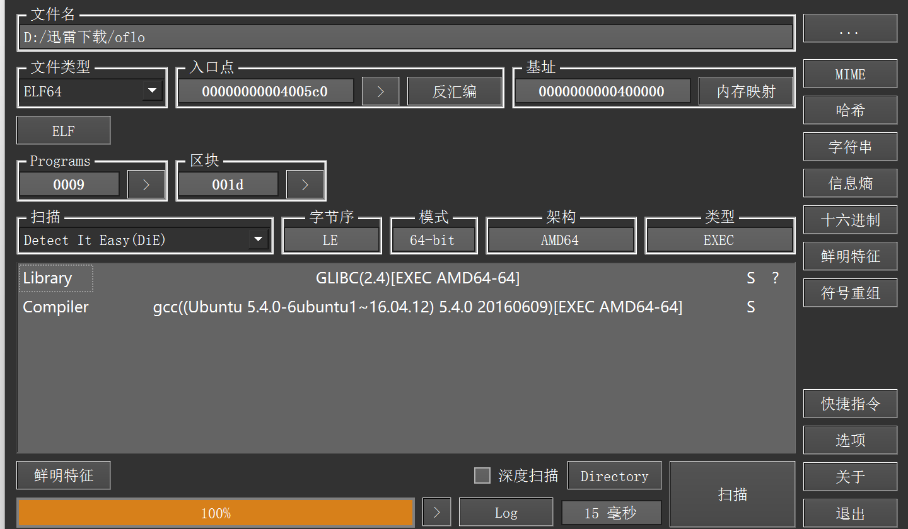

发现是个elf文件，没用壳。直接用IDA打开。

在ODA里面找到main函数，发现不能直接转换为伪代码。

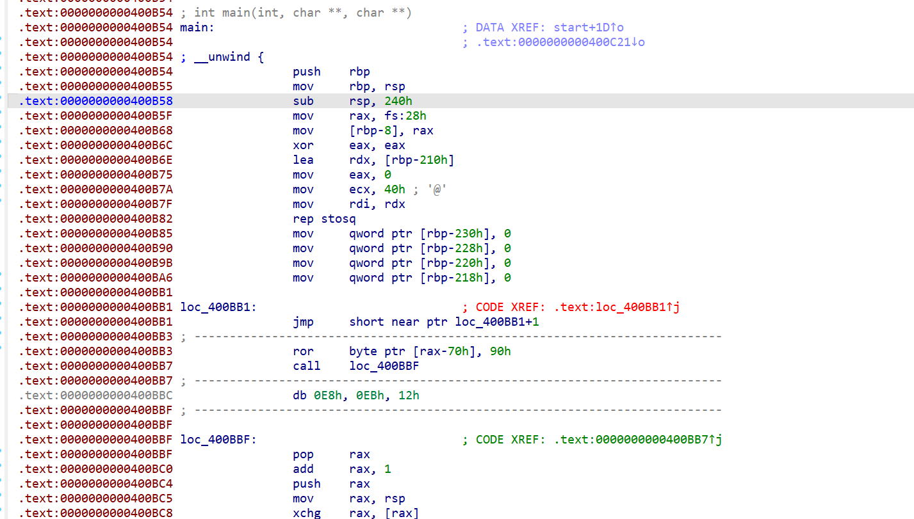

直接看汇编指令。在0000000000400BB1处IDA解析的汇编有问题，依据loc_400BB1+1，将400BB1处第一个字节nop，继续往下看 ，看到一个奇怪的调用( call    loc_400BBF)，

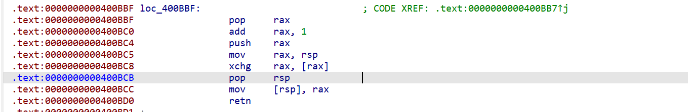

 `call 400BBF` 执行时会将下一条指令地址 `400BBC` 压入栈中，随后 `pop rax` 将该返回地址取出，再通过 `add rax, 1` 将其修改为 `400BBD`，最终通过 `retn` 将执行流转移到 `400BBD`。 

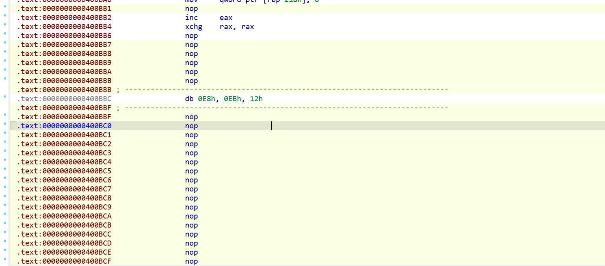

已知从400BBD开始，所以将400BBD开始的内容转换为code，400BBC直接nop.

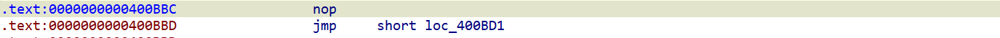

这里直接跟进loc_400BD1，

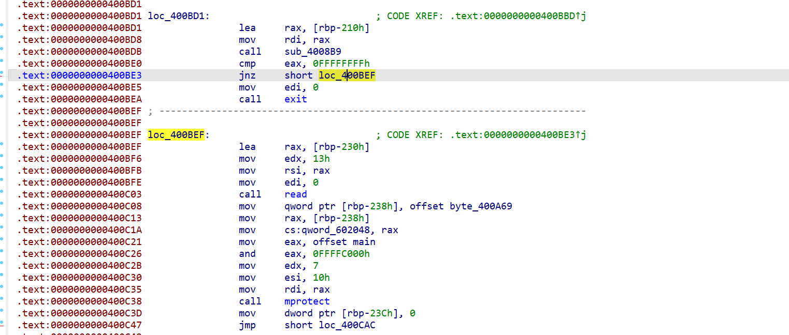

这里看到三个函数sub_4008B9，loc_400BEF，loc_400CAC，通过跟进函数可以发现sub_4008B9，loc_400BEF这两个函数都没用问题，但是loc_400CAC处有和之前相似的花指令。

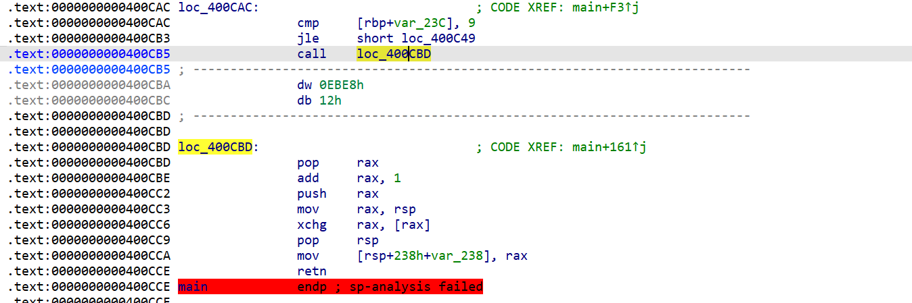

直接用之前的方法，把

```
400CB5-400CBA 和400CBD-400CCE
```

全部patch 为nop。

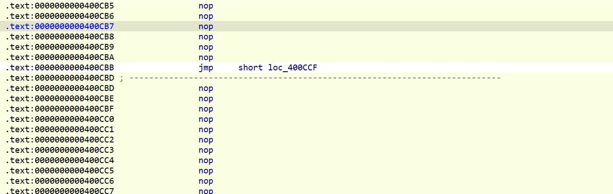

出现

```
jmp     short loc_400CCF
```

继续跟进这个跳转。

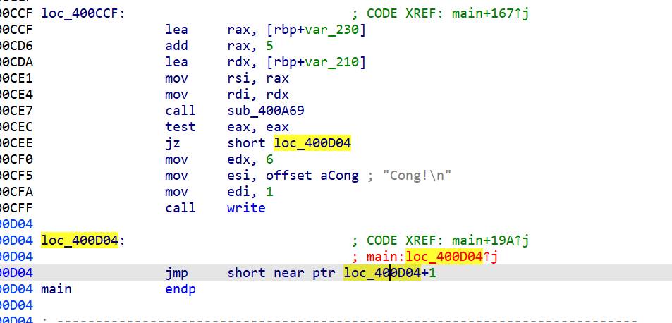

这里可以看到 在 `0x400D04` 又发现一个非常经典的花指令，还是直接将第一个字节 patch 为 nop。 

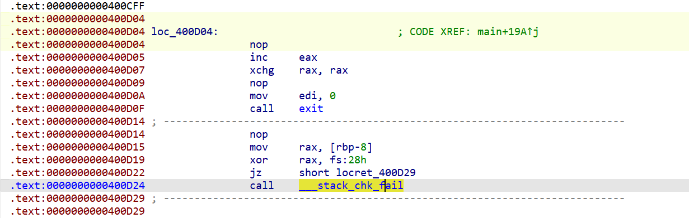

这样看起来就像一个正常的函数结尾了。

现在返回400B54(main的开头)，先 `p` 一下重新建立函数，之后就可以正常 `F5` 反编译了 。

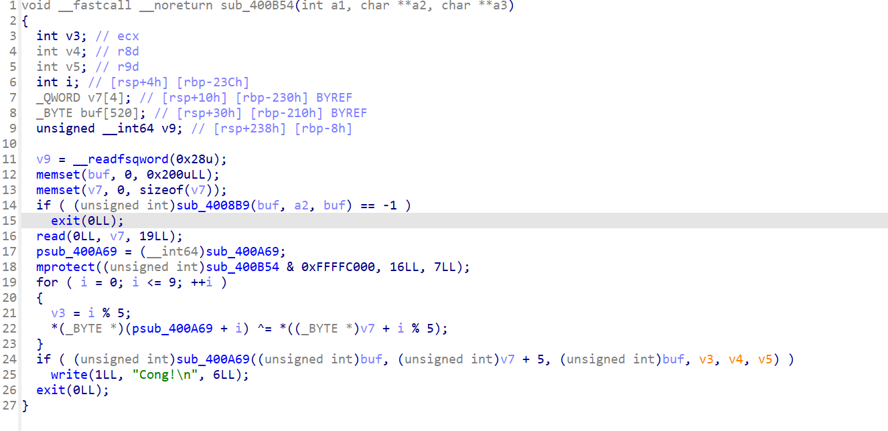

main函数的主要流程:

首先调用sub_4008B9;接着接收输入的19个字符;随后调用mprotect，修改sub_400B54 & 0xFFFFC000为首页地址区域的权限，将其改为 r | w | x ;紧跟着是改变400A69处的前10个字节;最终是调用sub_400A69检查flag是否正确。

```
程序开始
   ↓
调用 sub_4008B9
   ↓
接收用户输入 19 个字符
   ↓
调用 mprotect
   ↓
将代码所在内存页权限修改为
R | W | X
   ↓
使用输入的前 5 个字符
循环 XOR 修改 sub_400A69
的前 10 个字节
   ↓
恢复出运行时真正执行的代码
   ↓
调用 sub_400A69
   ↓
进行 Flag 校验
   ↓
┌───────────────┐
│   校验是否正确 │
└───────┬───────┘
        ↓
   正确        错误
    ↓            ↓
输出 Cong!     返回失败
```

由于题目是:N1CTF2020 - oflo,所以输入的前5个字符是n1ctf，

使用IDA中的python，修改400A69。

```
import idc

s = 'n1ctf'

for i in range(0x400A69, 0x400A69 + 10):
    c = idc.get_db_byte(i)
    c ^= ord(s[(i - 0x400A69) % 5])
    idc.patch_byte(i, c)
```

改完发现400A69还是不能进行反汇编，

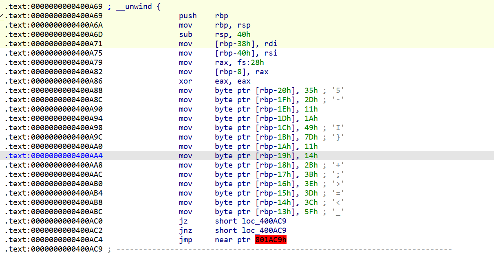

在400AC4处发现问题，前面是

```
jz      short loc_400AC9
jnz     short loc_400AC9
```

说明不论条件如何，最终都应该跳转到400AC9处。

那么

```
jmp     near ptr 801AC9h
```

就是没用的指令，直接nop

继续往下看发现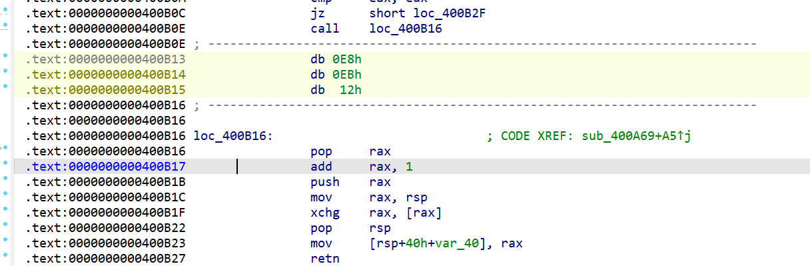

400B0E处的花指令和之前遇到的一样，按照之前的方法nop。

处理完就能看到400A69的反汇编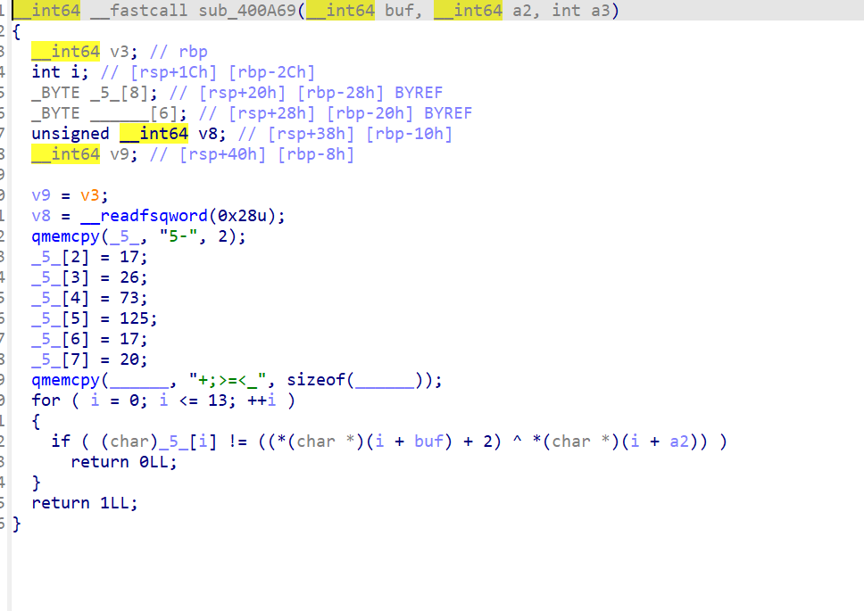

根据传入的参数，a2是V7+5，即去掉开头的输入。现在还有buf不知道，在main函数中寻找哪里出现过buf。


发现

```
 (unsigned int)sub_4008B9(buf, a2, buf) == -1
```

这里出现buf。由于内部太复制，直接动态调试，查看buf的值。


我在400CE7处下断点，查看rdi的内容。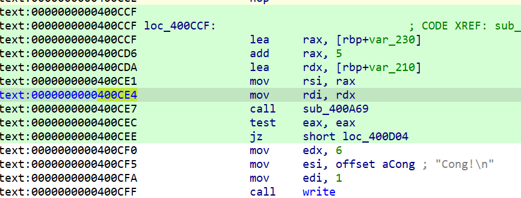

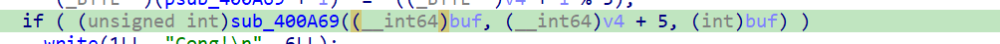

这里说明了sub_A69函数调用的位置和buf作为第一个参数传入函数。在LINUX中第一个参数由rdi保存。

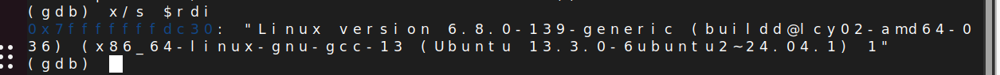在这里能看到buf的前14个字符是 "Linux version  "

 因此我们很容易便能得到 flag 内容 

```
s = "5-\x11\x1AI}\x11\x14+;>=<_"
b = "Linux version "
ans = ""

for i in range(14):
    ans += chr(ord(s[i]) ^ (ord(b[i]) + 2))
print(ans)
```

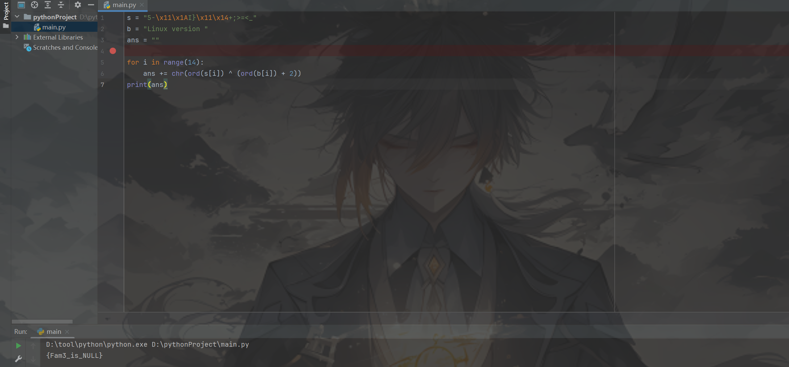

结果是 {Fam3_is_NULL} 

加上前面的5个字符，完整的flag就是n1ctf{Fam3_is_NULL}。
