# RC4 + VM 逆向分析

[题目地址](https://crackmes.one/static/crackme/6a2546b9cfb8af60da6bf9ee.zip)

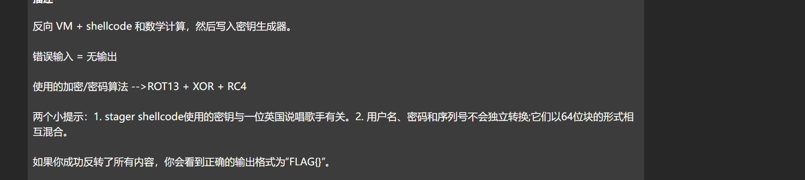

首先，拿到题目查看是否有壳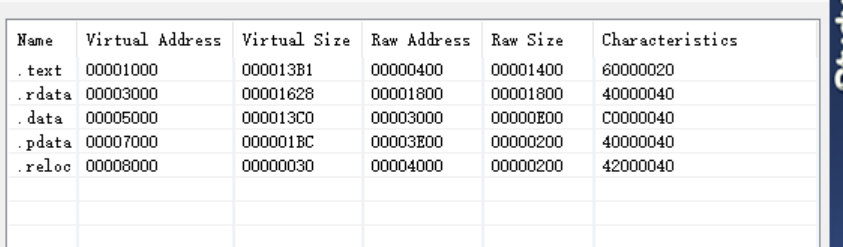从区段中能看到题目没有壳。

然后用IDA打开题目，一打开就是程序的主函数。

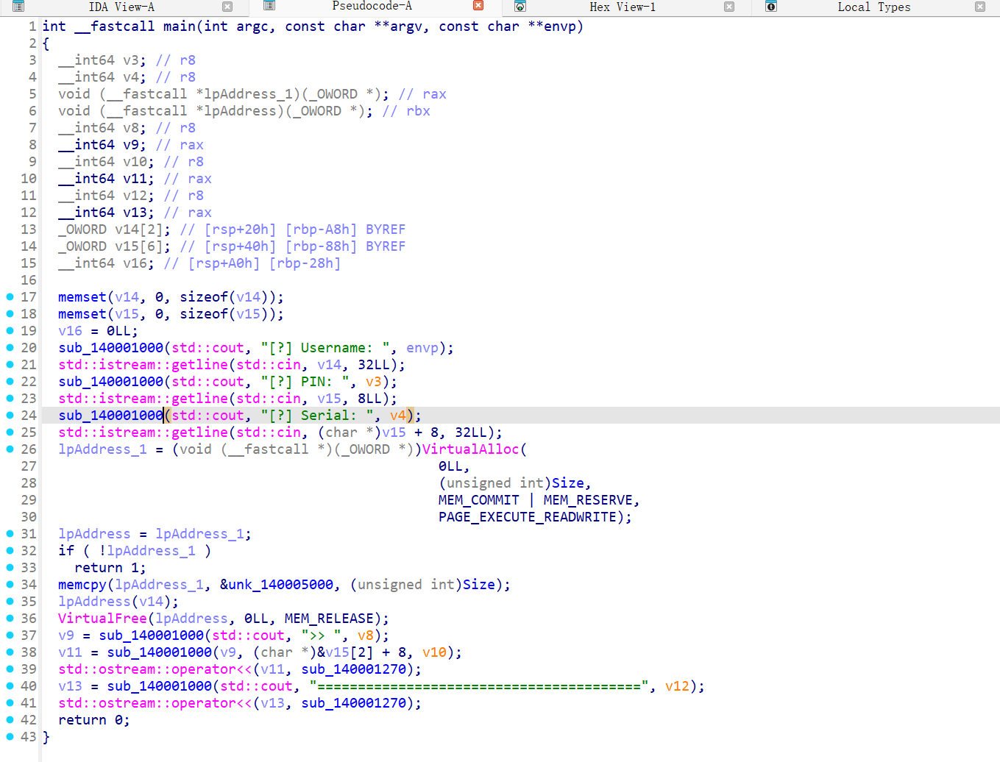

看主要的函数，首先是lpAddress_1，开辟了一个空间，通过Size可以看到大小是0xD2Bh，继续往下看if判断是否开辟空间成功。memcpy让lpAddress_1指向unk_140005000这个地址。跟进这个地址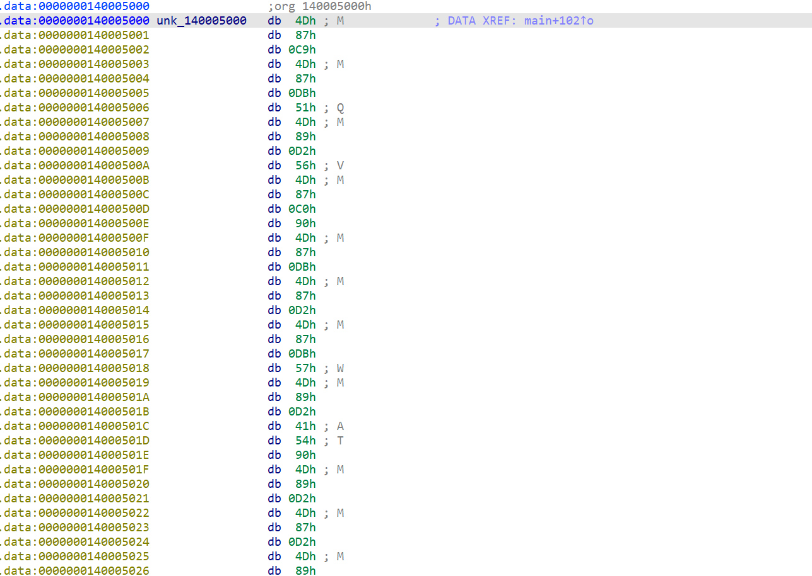发现是数据，但是在主函数上有lpAddress_1(v14)，说明这里是能传入一个参数的，这里就不可能是数据，肯定是代码。选定unk_140005000，按"C"就能将数据转换为代码。看这个函数的伪代码

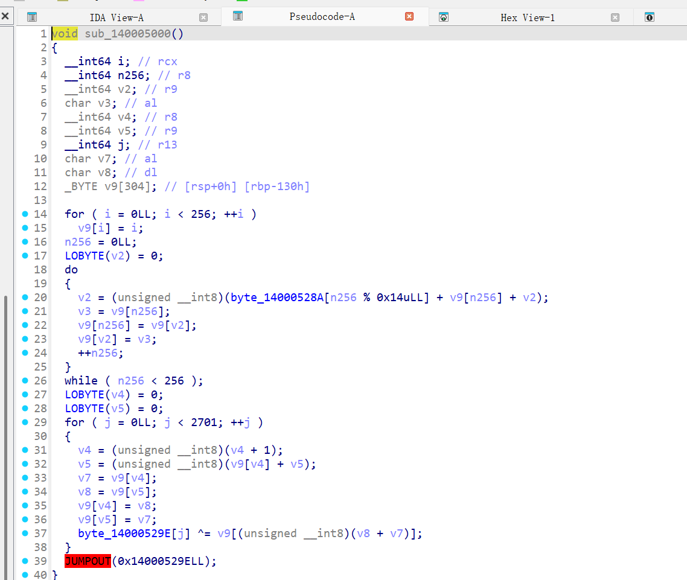

根据函数的特征可以确定是RC4。

```
Key 地址：
0x14000528A

Key：
centralCEE_33x000333

Key 长度：
0x14 = 20 bytes

待解密数据：
0x14000529E

长度：
0xA8D = 2701 bytes
```

算出需要解密的范围

```
0x14000529E + 0xA8D
= 0x140005D2B
```

先将需要的代码dump，在IDA自带的python写脚本。然后再对保存的文件进行RC4解密。

```python

start = 0x7FF79548529E
size = 0xA8D

data = ida_bytes.get_bytes(start, size)

if data is None:
    print("读取失败！")
else:
    print("成功读取:", len(data), "bytes")

    with open(r"D:\rc4_data.bin", "wb") as f:
        f.write(data)

    print("已保存到 D:\\rc4_data.bin")
```

```python
def rc4(key, data):
    S = list(range(256))
    j = 0

    # KSA
    for i in range(256):
        j = (j + S[i] + key[i % len(key)]) & 0xFF
        S[i], S[j] = S[j], S[i]

    # PRGA
    i = 0
    j = 0
    result = bytearray()

    for byte in data:
        i = (i + 1) & 0xFF
        j = (j + S[i]) & 0xFF
        S[i], S[j] = S[j], S[i]

        k = S[(S[i] + S[j]) & 0xFF]
        result.append(byte ^ k)

    return bytes(result)

with open(r"D:\rc4_data.bin", "rb") as f:
    ciphertext = f.read()

key = b"centralCEE_33x000333"

plaintext = rc4(key, ciphertext)

with open(r"D:\rc4_decrypted.bin", "wb") as f:
    f.write(plaintext)

print("输入数据:", len(ciphertext), "bytes")
print("解密数据:", len(plaintext), "bytes")
print("已保存到 D:\\rc4_decrypted.bin")
```
现在得到的文件就是解密好的，将文件拖入IDA中，选择64-bit mode。

进来后进行反汇编

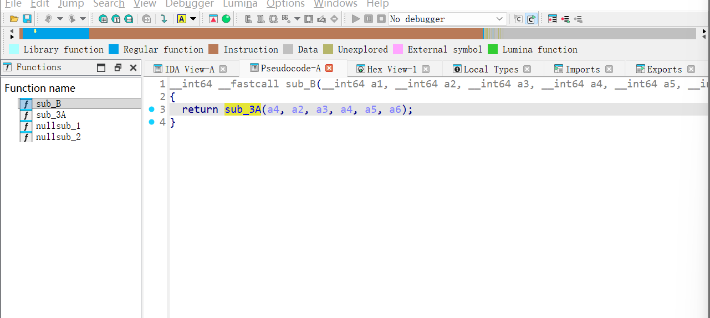

发现sub_3A才是重要的函数，跟进这个函数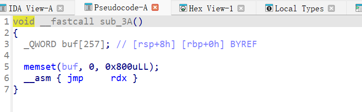发现这个函数的伪代码唯一的价值就是申请了800uLL的内存。伪代码没有价值就从汇编入手。

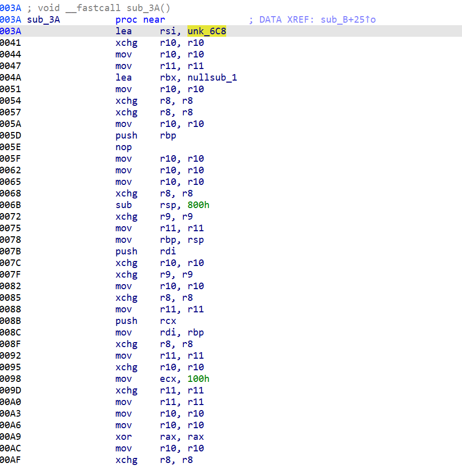

发现传入两个地址，一个传入rsi，一个传入rbx。

先看unk_6C8,能看到很多的数据

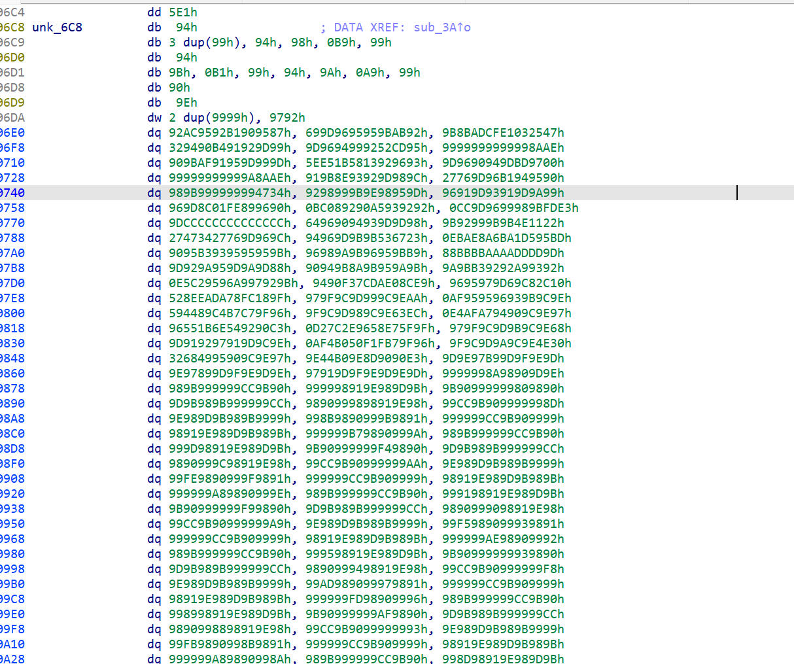

再看nullsub_1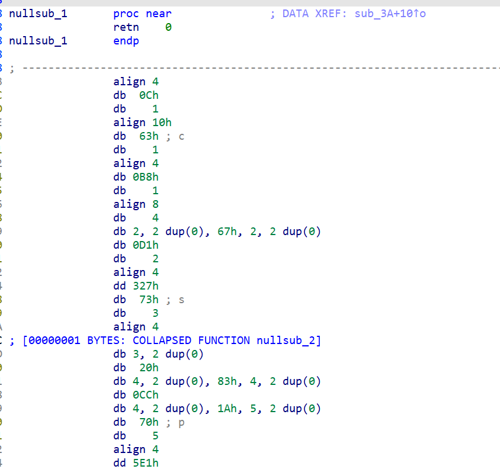

发现nullsub_1最顶端的代码有问题，那可能是数据被当作代码了，所以将其转换为数据。

看完两个地址后，继续看sub_3A，大致是开辟了一个0x800字节的地址

继续看发现下面有个loc_CF

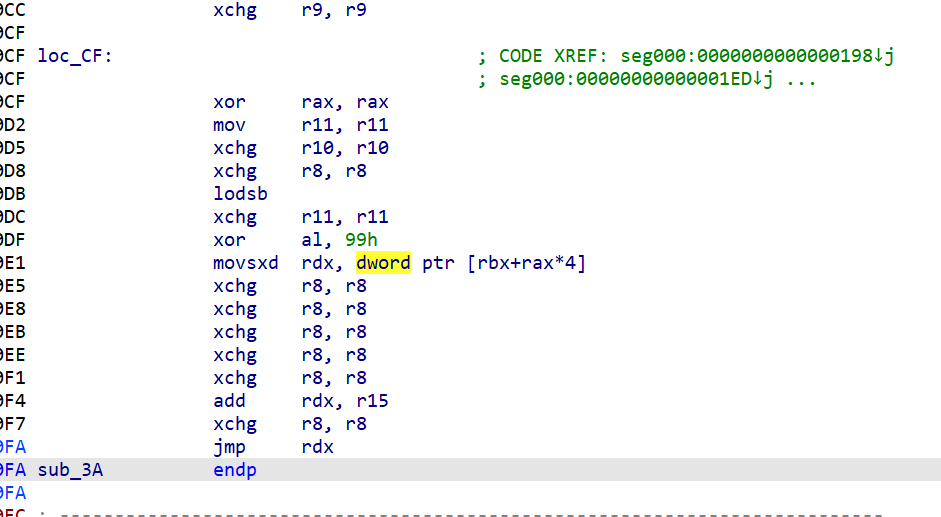

lodsb 等价于： 

`mov al, [rsi]
inc rsi`

movsxd  rdx, dword ptr [rbx+rax*4]

看到rbx，想到之前有一个地址传入rbx，后面的rax*4代表4个字节是一个，所以将nullsub_1中的数据都转换为dd(4字节一组)

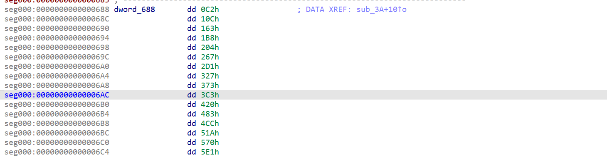

看到这里大致能知道程序的流程，从rsi中提取一个字符，然后与0x99进行异或，然后程序跳转到rdx中存储的地址。

```RSI
 ↓
提取一个字节
 ↓
与 0x99 异或
 ↓
得到 rax
 ↓
rdx=rbx+rax*4+r15
 ↓
将对应地址存入 RDX
 ↓
jmp RDX
```

现在需要找到r15代表的地址，

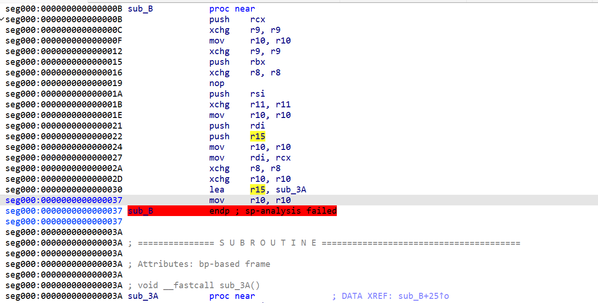

看到r15代表sub_3A的地址，所以RDX = RBX +RAX*4 +3A

这里就能看出，这是一道VM的题目了。

case0的地址：C2+3A=FC


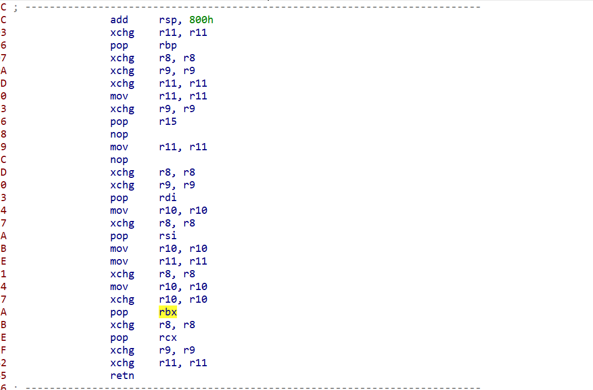

case 0 最终恢复寄存器并返回调用者，因此 case 0 是 VM 的 EXIT。

case1：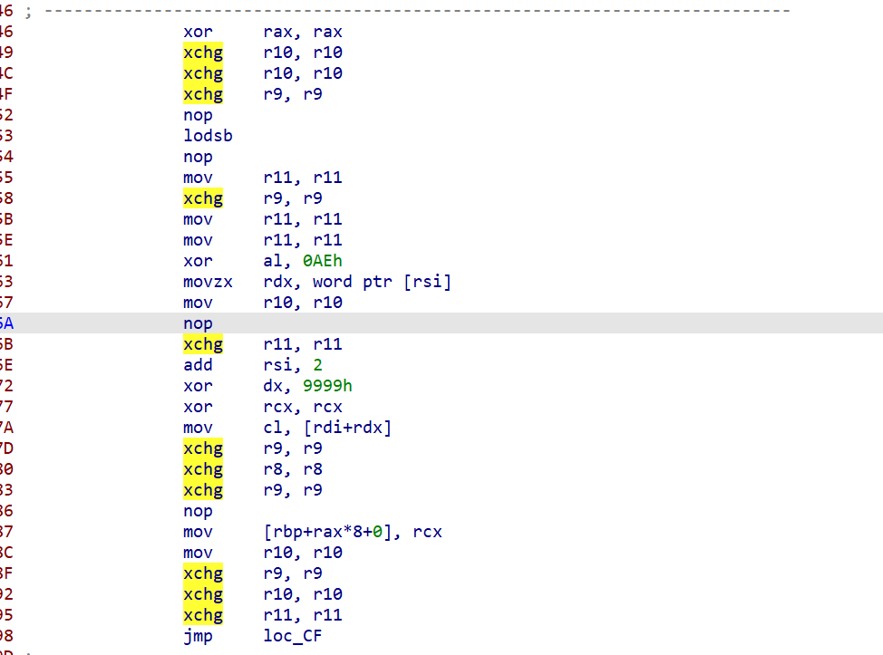

 从 `RDI` 指向的内存中读取 **1 字节**，放进 VM 寄存器 。

case2:

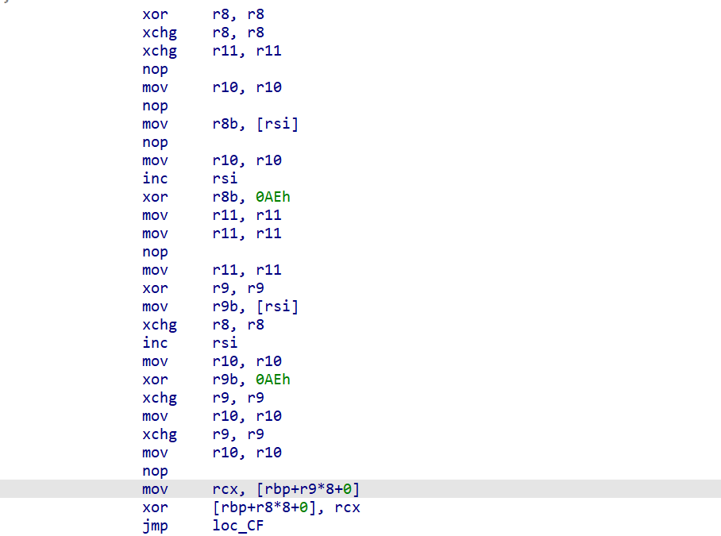

大致可以理解为a[r8]^=a[r9]。

case3:

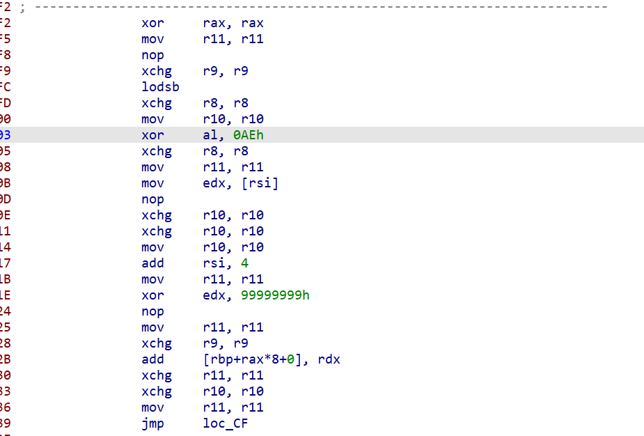

这就是一个add的指令。

```
VM[reg] = VM[reg] + imm32
```

case4:

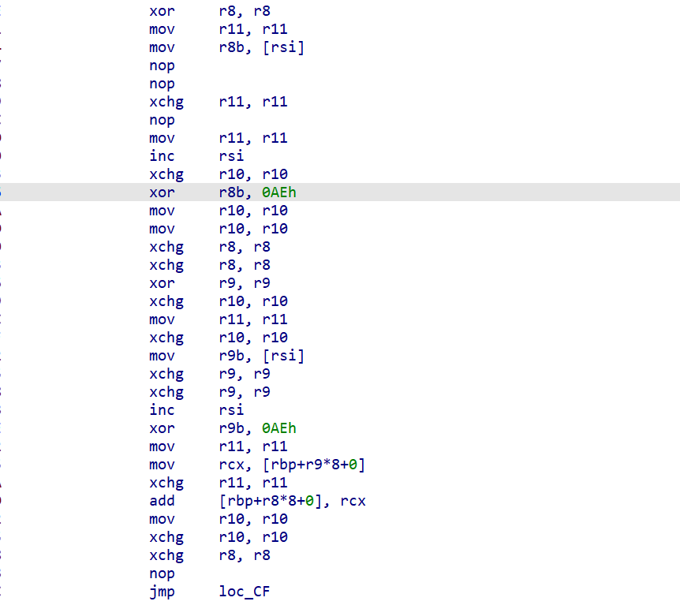

最主要的是

```
add     [rbp+r8*8+0], rcx
```

，能看到，这就是一个add的过程，即 

```
VM[dst] = VM[dst] + VM[src]
```

case5:

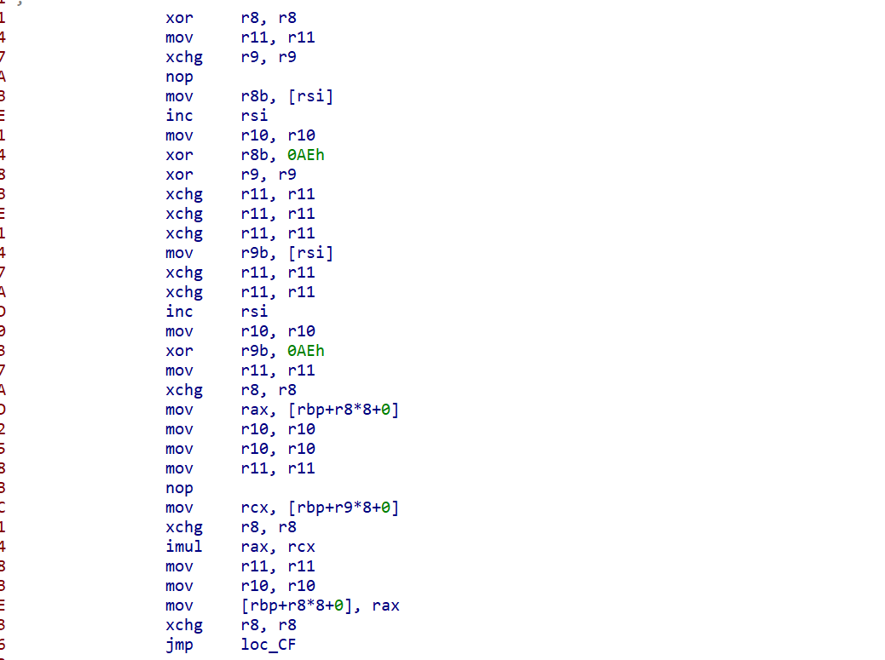

最重要的是imul    rax, rcx，

```
VM[dst] = VM[dst] * VM[src]
```

case6：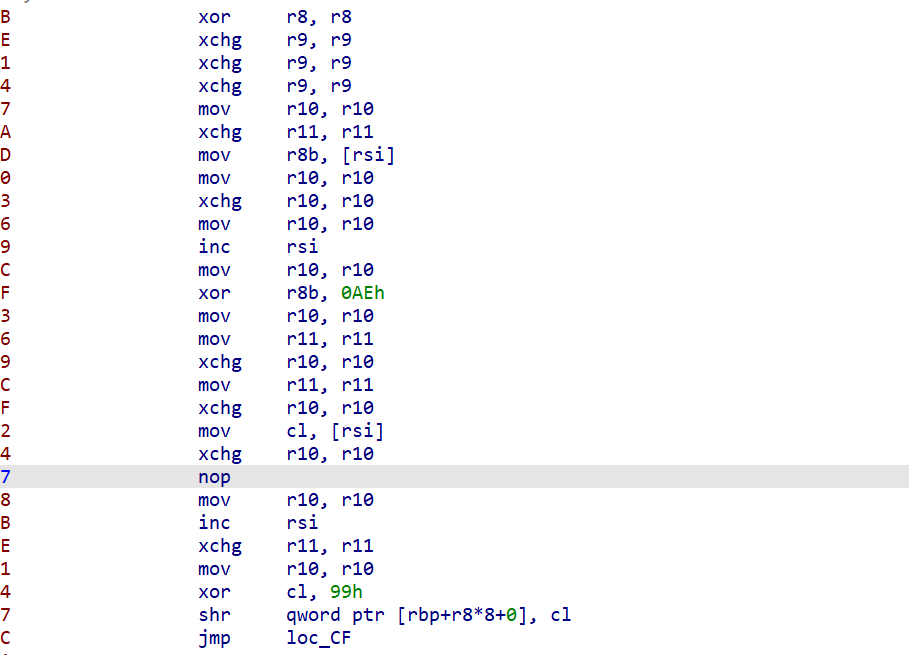

这里代表右移cl位。

case7:

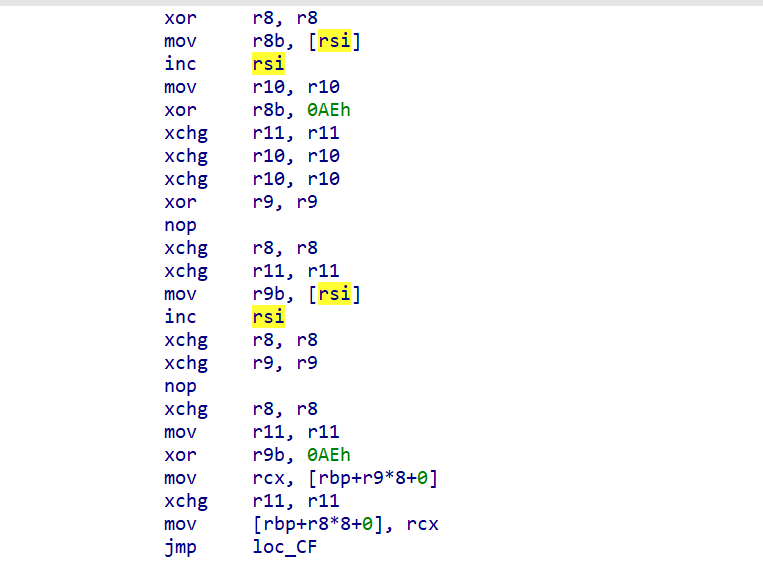

重要的汇编指令是：

```
mov     rcx, [rbp+r9*8+0]
  mov     [rbp+r8*8+0], rcx
```

```
即 VM[r8] = VM[r9]
```

case8: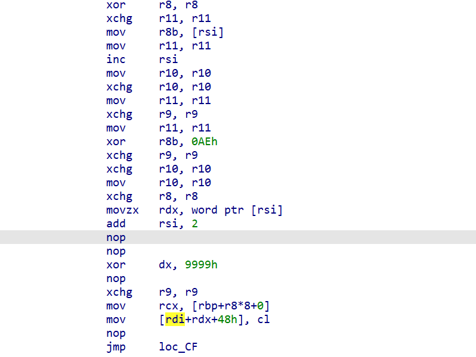

memory[0x48 + offset] = VM[reg] & 0xFF(这里其实是将字符存储到输出缓冲区)

case9：

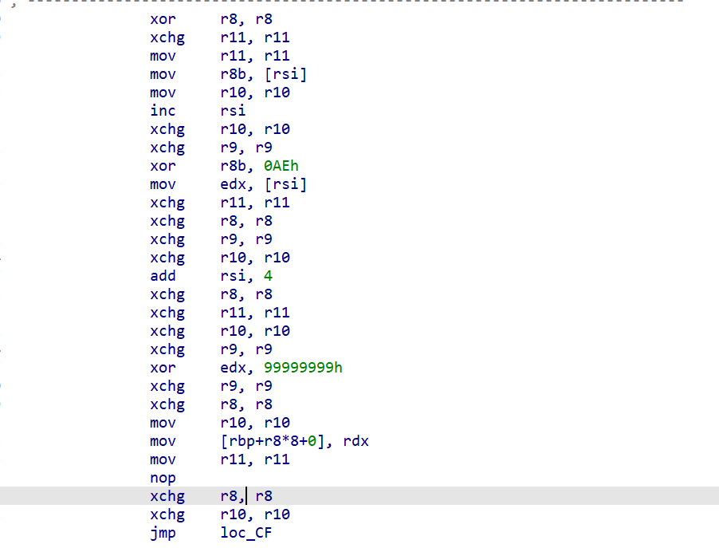

 从字节码读取 32 位立即数： VM[reg] = imm32 

case10-case15：

case10:and

case11:循环左移

case12:循环右移

case13:从rdi中读取8字节到rbp中(小端排序)

case14:OR 

case15:和case9一样，但是这里是将64位存入rbp+r8*8处。


 VM 字节码数量较多，如果全部依靠 IDA 手工分析，不仅效率低，而且容易在指令边界和参数解码上出错。因此根据前面分析出的 opcode 和参数编码规则，用 Python 重建 VM 的执行逻辑。 

```import struct
import sys


# ============================================================
# 基本配置
# ============================================================

BYTECODE_START = 0x6C8
VM_SIZE = 0x100          # 256 个 VM 槽
MASK64 = 0xFFFFFFFFFFFFFFFF


# ============================================================
# 加载解密后的 VM
# ============================================================

with open("rc4_decrypted.bin", "rb") as f:
    code = f.read()


# ============================================================
# 辅助函数
# ============================================================

def u8(data, pos):
    """读取 1 字节"""
    return data[pos]


def u16(data, pos):
    """读取 16 位小端"""
    return struct.unpack_from("<H", data, pos)[0]


def u32(data, pos):
    """读取 32 位小端"""
    return struct.unpack_from("<I", data, pos)[0]


def u64(data, pos):
    """读取 64 位小端"""
    return struct.unpack_from("<Q", data, pos)[0]


def rol64(x, n):
    n &= 0x3F
    x &= MASK64

    if n == 0:
        return x

    return ((x << n) | (x >> (64 - n))) & MASK64


def ror64(x, n):
    n &= 0x3F
    x &= MASK64

    if n == 0:
        return x

    return ((x >> n) | (x << (64 - n))) & MASK64


# ============================================================
# 参数解码
# ============================================================

def decode_reg(x):
    """
    VM 寄存器编号：
        encoded ^ 0xAE
    """
    return x ^ 0xAE


def decode_off16(x):
    """
    16 位 offset：
        encoded ^ 0x9999
    """
    return x ^ 0x9999


def decode_imm32(x):
    """
    32 位立即数：
        encoded ^ 0x99999999
    """
    return x ^ 0x99999999


def decode_imm64(x):
    """
    64 位立即数：
        encoded ^ 0x9999999999999999
    """
    return x ^ 0x9999999999999999


# ============================================================
# VM
# ============================================================

class VM:

    def __init__(self, bytecode, input_data):
        self.code = bytecode

        # RSI：字节码指针
        self.rsi = BYTECODE_START

        # RBP：VM 数据区
        self.vm = [0] * VM_SIZE

        # RDI：输入/输出缓冲区
        self.memory = bytearray(0x100)

        # 将输入放入 RDI 指向的数据区
        self.memory[:len(input_data)] = input_data

        self.running = True

    # --------------------------------------------------------
    # 从 VM 字节码读取数据
    # --------------------------------------------------------

    def read_u8(self):
        x = self.code[self.rsi]
        self.rsi += 1
        return x

    def read_u16(self):
        x = u16(self.code, self.rsi)
        self.rsi += 2
        return x

    def read_u32(self):
        x = u32(self.code, self.rsi)
        self.rsi += 4
        return x

    def read_u64(self):
        x = u64(self.code, self.rsi)
        self.rsi += 8
        return x

    # --------------------------------------------------------
    # 执行 VM
    # --------------------------------------------------------

    def run(self, debug=False):

        while self.running:

            instruction_addr = self.rsi

            # =================================================
            # 读取 opcode
            # =================================================
            #
            # 注意：
            # 只有 opcode ^ 0x99
            #
            raw_opcode = self.read_u8()
            opcode = raw_opcode ^ 0x99

            if debug:
                print(
                    f"\n[0x{instruction_addr:04X}] "
                    f"raw={raw_opcode:02X} "
                    f"case={opcode}"
                )

            # =================================================
            # case 0
            # =================================================

            if opcode == 0:

                if debug:
                    print("    CASE 0 -> EXIT")

                self.running = False


            # =================================================
            # case 1
            # LOAD8
            #
            # VM[reg] = memory[offset]
            # =================================================

            elif opcode == 1:

                reg = decode_reg(self.read_u8())
                offset = decode_off16(self.read_u16())

                value = self.memory[offset]

                self.vm[reg] = value

                if debug:
                    print(
                        f"    LOAD8 "
                        f"VM[{reg}] = memory[0x{offset:X}] "
                        f"= 0x{value:02X}"
                    )


            # =================================================
            # case 2
            # XOR
            #
            # VM[dst] ^= VM[src]
            # =================================================

            elif opcode == 2:

                dst = decode_reg(self.read_u8())
                src = decode_reg(self.read_u8())

                self.vm[dst] ^= self.vm[src]
                self.vm[dst] &= MASK64

                if debug:
                    print(
                        f"    XOR "
                        f"VM[{dst}] ^= VM[{src}]"
                    )


            # =================================================
            # case 3
            # ADD_IMM32
            #
            # VM[reg] += imm32
            # =================================================

            elif opcode == 3:

                reg = decode_reg(self.read_u8())
                imm = decode_imm32(self.read_u32())

                self.vm[reg] = (
                    self.vm[reg] + imm
                ) & MASK64

                if debug:
                    print(
                        f"    ADD_IMM32 "
                        f"VM[{reg}] += 0x{imm:08X}"
                    )


            # =================================================
            # case 4
            # ADD
            #
            # VM[dst] += VM[src]
            # =================================================

            elif opcode == 4:

                dst = decode_reg(self.read_u8())
                src = decode_reg(self.read_u8())

                self.vm[dst] = (
                    self.vm[dst] + self.vm[src]
                ) & MASK64

                if debug:
                    print(
                        f"    ADD "
                        f"VM[{dst}] += VM[{src}]"
                    )


            # =================================================
            # case 5
            # MUL
            #
            # VM[dst] *= VM[src]
            # =================================================

            elif opcode == 5:

                dst = decode_reg(self.read_u8())
                src = decode_reg(self.read_u8())

                self.vm[dst] = (
                    self.vm[dst] * self.vm[src]
                ) & MASK64

                if debug:
                    print(
                        f"    MUL "
                        f"VM[{dst}] *= VM[{src}]"
                    )


            # =================================================
            # case 6
            # SHR
            #
            # VM[reg] >>= count
            # =================================================

            elif opcode == 6:

                reg = decode_reg(self.read_u8())

                # shift count 的编码是 ^ 0x99
                count = self.read_u8() ^ 0x99

                count &= 0x3F

                self.vm[reg] >>= count

                if debug:
                    print(
                        f"    SHR "
                        f"VM[{reg}] >>= {count}"
                    )


            # =================================================
            # case 7
            # MOV
            #
            # VM[dst] = VM[src]
            # =================================================

            elif opcode == 7:

                dst = decode_reg(self.read_u8())
                src = decode_reg(self.read_u8())

                self.vm[dst] = self.vm[src]

                if debug:
                    print(
                        f"    MOV "
                        f"VM[{dst}] = VM[{src}]"
                    )


            # =================================================
            # case 8
            # STORE8
            #
            # memory[0x48 + offset] = VM[reg] & 0xFF
            # =================================================

            elif opcode == 8:

                reg = decode_reg(self.read_u8())
                offset = decode_off16(self.read_u16())

                address = 0x48 + offset

                value = self.vm[reg] & 0xFF

                self.memory[address] = value

                if debug:
                    print(
                        f"    STORE8 "
                        f"memory[0x{address:X}] "
                        f"= VM[{reg}] & 0xFF "
                        f"= 0x{value:02X}"
                    )


            # =================================================
            # case 9
            # SET32
            #
            # VM[reg] = imm32
            # =================================================

            elif opcode == 9:

                reg = decode_reg(self.read_u8())
                imm = decode_imm32(self.read_u32())

                self.vm[reg] = imm

                if debug:
                    print(
                        f"    SET32 "
                        f"VM[{reg}] = 0x{imm:08X}"
                    )


            # =================================================
            # case 10
            # AND
            #
            # VM[dst] &= VM[src]
            # =================================================

            elif opcode == 10:

                dst = decode_reg(self.read_u8())
                src = decode_reg(self.read_u8())

                self.vm[dst] &= self.vm[src]

                if debug:
                    print(
                        f"    AND "
                        f"VM[{dst}] &= VM[{src}]"
                    )


            # =================================================
            # case 11
            # ROL
            # =================================================

            elif opcode == 11:

                reg = decode_reg(self.read_u8())
                count = self.read_u8() ^ 0x99

                self.vm[reg] = rol64(
                    self.vm[reg],
                    count
                )

                if debug:
                    print(
                        f"    ROL "
                        f"VM[{reg}], {count}"
                    )


            # =================================================
            # case 12
            # ROR
            # =================================================

            elif opcode == 12:

                reg = decode_reg(self.read_u8())
                count = self.read_u8() ^ 0x99

                self.vm[reg] = ror64(
                    self.vm[reg],
                    count
                )

                if debug:
                    print(
                        f"    ROR "
                        f"VM[{reg}], {count}"
                    )


            # =================================================
            # case 13
            # LOAD64
            #
            # VM[reg] = memory[offset : offset+8]
            # =================================================

            elif opcode == 13:

                reg = decode_reg(self.read_u8())
                offset = decode_off16(self.read_u16())

                value = struct.unpack_from(
                    "<Q",
                    self.memory,
                    offset
                )[0]

                self.vm[reg] = value

                if debug:
                    print(
                        f"    LOAD64 "
                        f"VM[{reg}] = "
                        f"memory[0x{offset:X}:0x{offset+8:X}] "
                        f"= 0x{value:016X}"
                    )


            # =================================================
            # case 14
            # OR
            #
            # VM[dst] |= VM[src]
            # =================================================

            elif opcode == 14:

                dst = decode_reg(self.read_u8())
                src = decode_reg(self.read_u8())

                self.vm[dst] |= self.vm[src]
                self.vm[dst] &= MASK64

                if debug:
                    print(
                        f"    OR "
                        f"VM[{dst}] |= VM[{src}]"
                    )


            # =================================================
            # case 15
            # SET64
            #
            # VM[reg] = imm64
            # =================================================

            elif opcode == 15:

                reg = decode_reg(self.read_u8())
                imm = decode_imm64(self.read_u64())

                self.vm[reg] = imm

                if debug:
                    print(
                        f"    SET64 "
                        f"VM[{reg}] = 0x{imm:016X}"
                    )


            # =================================================
            # 未知 opcode
            # =================================================

            else:

                raise RuntimeError(
                    f"未知 opcode: {opcode} "
                    f"(位置 0x{instruction_addr:X})"
                )

        return self.memory


# ============================================================
# 输入处理
# ============================================================

def build_input(username, pin, serial):
    """
    根据主程序的布局构造 RDI 指向的内存。

    RDI + 0x00 -> Username
    RDI + 0x20 -> PIN
    RDI + 0x28 -> Serial
    RDI + 0x48 -> 输出区域
    """

    buf = bytearray(0x100)

    username_b = username.encode()
    pin_b = pin.encode()
    serial_b = serial.encode()

    if len(username_b) > 0x20:
        raise ValueError("Username 长度超过 0x20")

    if len(pin_b) > 8:
        raise ValueError("PIN 长度超过 8")

    if len(serial_b) > 0x20:
        raise ValueError("Serial 长度超过 0x20")

    buf[0x00:0x00 + len(username_b)] = username_b
    buf[0x20:0x20 + len(pin_b)] = pin_b
    buf[0x28:0x28 + len(serial_b)] = serial_b

    return bytes(buf)


# ============================================================
# 主程序
# ============================================================

if __name__ == "__main__":

    # --------------------------------------------------------
    # 你可以先自己随便填一个输入测试
    # --------------------------------------------------------

    username = "test"
    pin = "12345678"
    serial = "testserial"

    input_data = build_input(
        username,
        pin,
        serial
    )

    vm = VM(
        code,
        input_data
    )

    # --------------------------------------------------------
    # debug=True：
    # 把每一条 VM 指令打印出来
    #
    # 第一次运行强烈建议 True
    # 确认 RSI 是否正确推进
    # --------------------------------------------------------

    result = vm.run(debug=True)

    # --------------------------------------------------------
    # 输出区域从 RDI + 0x48 开始
    # --------------------------------------------------------

    output = result[0x48:]

    print("\n" + "=" * 60)
    print("VM 输出：")

    # 找 \0
    if b"\x00" in output:
        output = output.split(b"\x00", 1)[0]

    print(output)

    try:
        print(output.decode())
    except UnicodeDecodeError:
        print("输出不是合法 ASCII/UTF-8")

    print("=" * 60)

    # 查看关键 VM 寄存器
    print("\n关键 VM 值：")
    print(f"VM[48] = 0x{vm.vm[48]:016X}")
    print(f"VM[52] = 0x{vm.vm[52]:016X}")
    print(f"VM[53] = 0x{vm.vm[53]:016X}")
    print(f"VM[54] = 0x{vm.vm[54]:016X}")
    print(f"VM[55] = 0x{vm.vm[55]:016X}")
```

这样就能快速得到每一步在做什么，重点要关注输入和输出的位置，由上面的case分支的分析，已经知道输入是case1和case13,输出是case8.

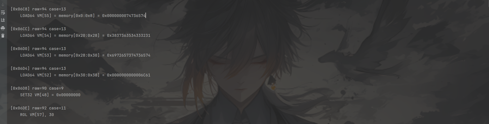

从python跑出的结果看，最开始的4个指令是输入指令，分别是VM[55/54/53/52]

跟着这些地址去寻找程序在哪里对输入进行变化

经过我的整理，发现大致过程

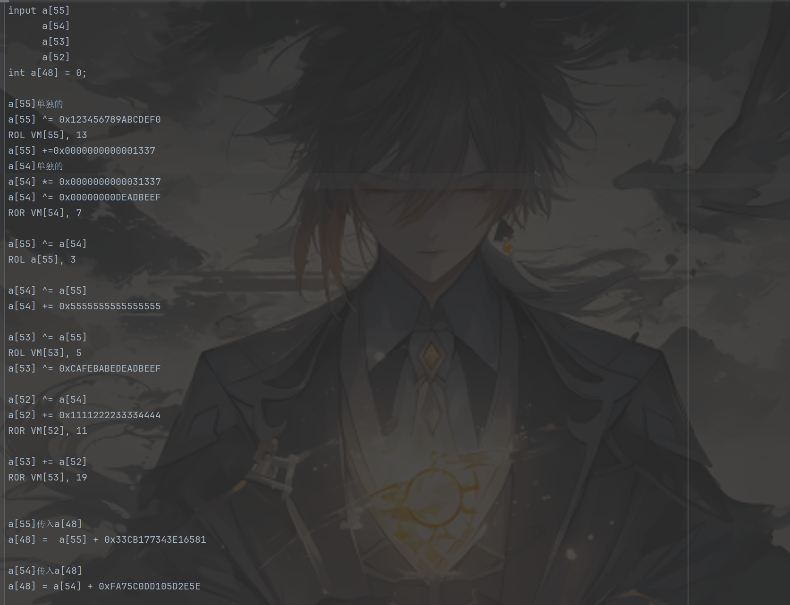

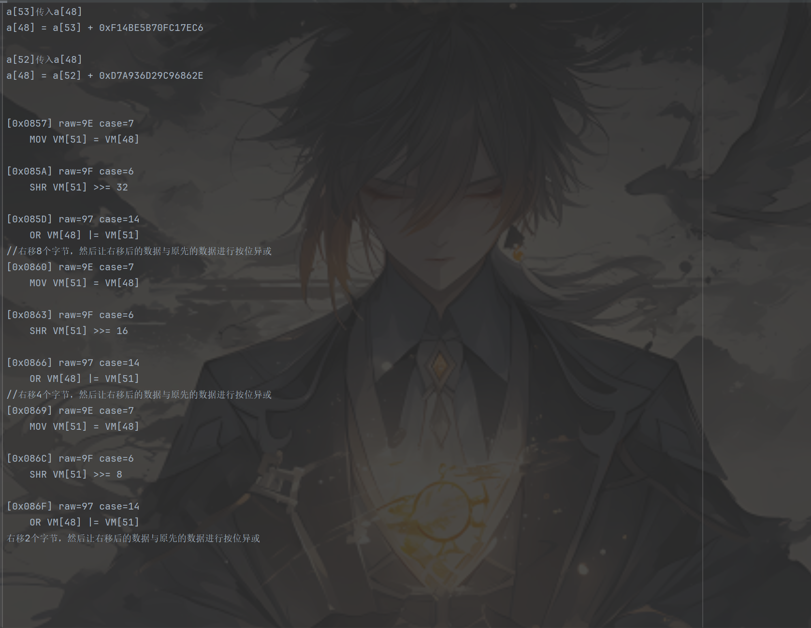

在后面的过程中，我发现都是类似的

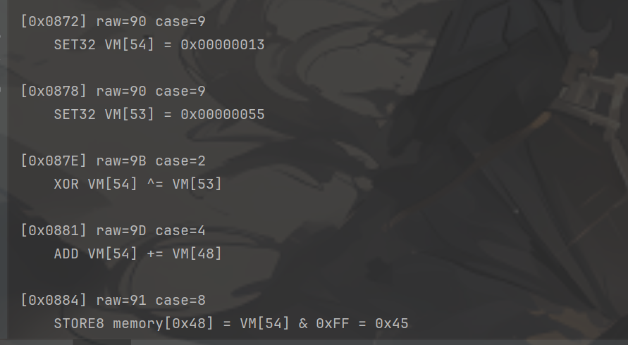

大致意思是给两个值进行异或，然后加上VM[48]中的十六进制数,最后是强制转换为1个字节的形式。

并且我发现图中的VM[53]和VM[54]进行异或后，0x55 ^ 0x13 = 0x46 = 'F'，这就是我们所需的输出。用脚本验证一下

```python
bases = [
    0x13,
    0x19,
    0x14,
    0x12,
    0x2E,
    0x6D,
    0x33,
    0x67,
    0x31,
    0x60,
    0x30,
    0x6C,
    0x37,
    0x0A,
    0x61,
    0x34,
    0x64,
    0x36,
    0x0A,
    0x62,
    0x31,
    0x66,
    0x33,
    0x28,
]

vm48 = 0  # 正确输入时，最终低8位应为0

result = ""

for base in bases:
    value = (base ^ 0x55) + (vm48 & 0xFF)
    value &= 0xFF
    result += chr(value)

print(result)
```

可以看到得出结果是 FLAG{8f2d5e9b_4a1c_7d3f} ，符合题目的要求，所以这就是正确的输出。

现在要进行反推，找到正确的输入

 最终输出只要求 `VM[48] & 0xFF = 0`。为了便于逆向计算，这里选择更强的充分条件 `VM[48] = 0` 作为目标。 

```python
MASK = 0xFFFFFFFFFFFFFFFF


def rol(x, n):
    n %= 64
    return ((x << n) | (x >> (64 - n))) & MASK


def ror(x, n):
    n %= 64
    return ((x >> n) | (x << (64 - n))) & MASK


def inv_mul(x, c):
    """
    逆：
        x = old * c  mod 2^64

    因为 0x31337 是奇数，所以存在模 2^64 的乘法逆元
    """
    inv_c = pow(c, -1, 1 << 64)
    return (x * inv_c) & MASK


# =========================================================
# 第一步：由最终 VM[48] = 0 得到四个目标值
#
# 0x07F7:
#     VM48 |= VM50
#     VM50 = VM55 + 0x33CB177343E16581
#
# 要让 VM48 最终保持 0：
#
#     VM55 + 0x33CB177343E16581 = 0
# =========================================================

vm55 = (-0x33CB177343E16581) & MASK

# 0x0810
vm54 = (-0xFA75C0DD105D2E5E) & MASK

# 0x082F
vm53 = (-0xF14BE5B70FC17EC6) & MASK

# 0x084? 后面的第四次 OR
vm52 = (-0xD7A936D29C96862E) & MASK


print("===== 最终目标 =====")
print(f"VM55 = {vm55:016X}")
print(f"VM54 = {vm54:016X}")
print(f"VM53 = {vm53:016X}")
print(f"VM52 = {vm52:016X}")
print()


# =========================================================
# 第二步：严格按照  VM 代码的逆顺序
#
# 注意：
# 不能分别独立逆 VM55 / VM54 / VM53 / VM52
# 因为它们中间存在 XOR / ADD 依赖。
# =========================================================


# ---------------------------------------------------------
# 07CE
#
# VM52 ^= VM53
#
# 逆：
# ---------------------------------------------------------

vm52 ^= vm53


# ---------------------------------------------------------
# 07C2
#
# VM53 = ROR(VM53, 19)
#
# 逆 = ROL
# ---------------------------------------------------------

vm53 = rol(vm53, 19)


# ---------------------------------------------------------
# 07BF
#
# VM53 += VM52
#
# 逆：
# ---------------------------------------------------------

vm53 = (vm53 - vm52) & MASK


# ---------------------------------------------------------
# 07BC
#
# VM52 = ROR(VM52, 11)
#
# 逆 = ROL
# ---------------------------------------------------------

vm52 = rol(vm52, 11)


# ---------------------------------------------------------
# 07B9
#
# VM52 += 0x1111222233334444
#
# 逆：
# ---------------------------------------------------------

vm52 = (vm52 - 0x1111222233334444) & MASK


# ---------------------------------------------------------
# 07AC
#
# VM52 ^= VM54
#
# ---------------------------------------------------------

vm52 ^= vm54


# ---------------------------------------------------------
# 0793
#
# VM53 ^= 0xCAFEBABEDEADBEEF
#
# ---------------------------------------------------------

vm53 ^= 0xCAFEBABEDEADBEEF


# ---------------------------------------------------------
# 0786
#
# VM53 = ROL(VM53, 5)
#
# 逆 = ROR
# ---------------------------------------------------------

vm53 = ror(vm53, 5)


# ---------------------------------------------------------
# 0783
#
# VM53 ^= VM55
#
# ---------------------------------------------------------

vm53 ^= vm55


# ---------------------------------------------------------
# 0777
#
# VM54 += 0x5555555555555555
#
# 逆：
# ---------------------------------------------------------

vm54 = (vm54 - 0x5555555555555555) & MASK


# ---------------------------------------------------------
# 076A
#
# VM54 ^= VM55
#
# ---------------------------------------------------------

vm54 ^= vm55


# ---------------------------------------------------------
# 074F
#
# VM55 = ROL(VM55, 3)
#
# 逆 = ROR
# ---------------------------------------------------------

vm55 = ror(vm55, 3)


# ---------------------------------------------------------
# 074C
#
# VM55 ^= VM54
#
# ---------------------------------------------------------

vm55 ^= vm54


# ---------------------------------------------------------
# 0749
#
# VM54 = ROR(VM54, 7)
#
# 逆 = ROL
# ---------------------------------------------------------

vm54 = rol(vm54, 7)


# ---------------------------------------------------------
# 0746
#
# VM54 ^= 0xDEADBEEF
#
# ---------------------------------------------------------

vm54 ^= 0xDEADBEEF


# ---------------------------------------------------------
# 0730
#
# VM54 *= 0x31337
#
# 逆：
# ---------------------------------------------------------

vm54 = inv_mul(vm54, 0x31337)


# ---------------------------------------------------------
# 0710
#
# VM55 += 0x1337
#
# 逆：
# ---------------------------------------------------------

vm55 = (vm55 - 0x1337) & MASK


# ---------------------------------------------------------
# 0703
#
# VM55 = ROL(VM55, 13)
#
# 逆 = ROR
# ---------------------------------------------------------

vm55 = ror(vm55, 13)


# ---------------------------------------------------------
# 06F7
#
# VM55 ^= 0x123456789ABCDEF0
#
# ---------------------------------------------------------

vm55 ^= 0x123456789ABCDEF0


# =========================================================
# 第三步：查看反推出的 64 位数据
# =========================================================

print("===== 反推结果 =====")
print(f"VM55 = {vm55:016X}")
print(f"VM54 = {vm54:016X}")
print(f"VM53 = {vm53:016X}")
print(f"VM52 = {vm52:016X}")
print()


# =========================================================
# 第四步：64 位整数 -> 8 字节
#
# VM 使用的是 little endian
# =========================================================

b55 = vm55.to_bytes(8, "little")
b54 = vm54.to_bytes(8, "little")
b53 = vm53.to_bytes(8, "little")
b52 = vm52.to_bytes(8, "little")


print("===== 原始字节 =====")
print("VM55:", b55)
print("VM54:", b54)
print("VM53:", b53)
print("VM52:", b52)
print()


# =========================================================
# 第五步：去掉 LOAD64 后面的 \x00
# =========================================================

username = b55.rstrip(b"\x00").decode("ascii")
pin = b54.rstrip(b"\x00").decode("ascii")

serial = (
    b53 + b52
).rstrip(b"\x00").decode("ascii")


print("================================")
print("Username =", username)
print("PIN      =", pin)
print("Serial   =", serial)
print("================================")
```

这样就能得到输入的字符串

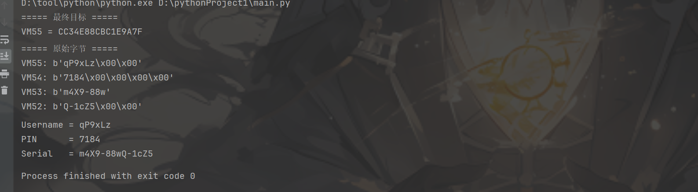

注：

1.我最开始不知道，输入的字符串是从哪里传进来的，所以就从字符串输入的地方，看看被储存在哪里，这里能看到输入的字符串存储在[rsp+0C8h+var_A8]处。

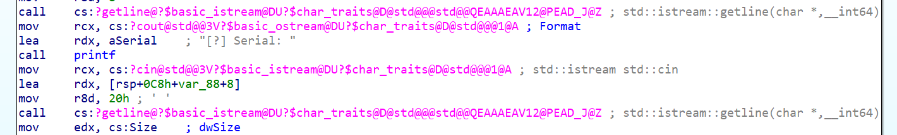

接下来就跟踪这个地址，去看看哪里还用到这个地址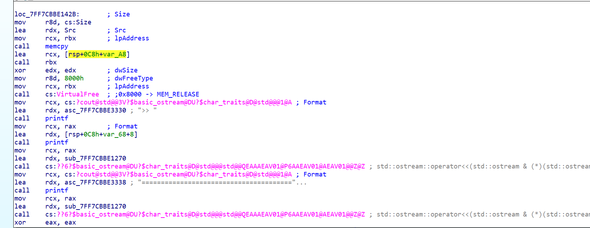

发现这个地址传入rcx，然后跟踪rcx这个寄存器，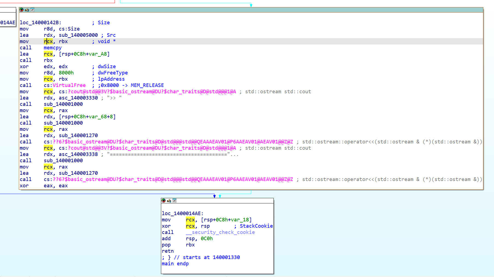发现 在主函数中，输入完成后将输入缓冲区首地址装入 `RCX`，随后调用解密后的 VM。所以进入rc4_decrypted.bin中寻找rcx。

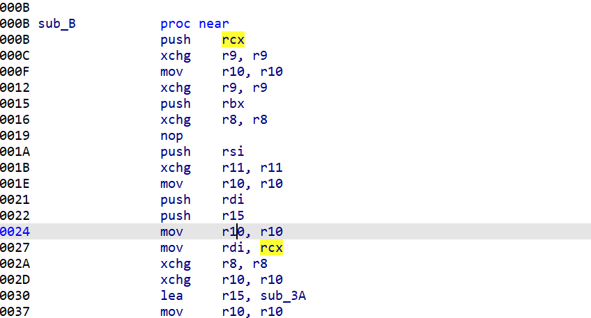

```
push    rcx
```

在这里发现rcx先被压入栈

```
 mov     rdi, rcx
```

看到这里就说明rdi保存输入缓冲区的地址，而不是保存输入字符串本身。

```
Username / PIN / Serial
          ↓
      getline()
          ↓
      栈上的缓冲区
          ↓
   RCX = 缓冲区首地址
          ↓
       call VM
          ↓
     RDI = RCX
          ↓
       LOAD64
          ↓
 VM55 / VM54 / VM53 / VM52
```


2.破解完VM指令后，我不理解为什么这些虚拟指令中没有比较函数，没有比较函数的话就不能知道我的输入和输出是正确的还是错误的。所以我把字节码中存储的指令都写入python，毕竟看汇编指令比看字节码方便不少。 在当前分析到的 VM 字节码中，没有发现显式的输入比较或条件分支逻辑。程序主要对输入进行一系列运算，并最终通过 `STORE8` 生成输出。因此本题更接近‘构造指定输出’的形式，使用者可以通过最终输出是否为题目要求的 Flag 来判断结果。 
